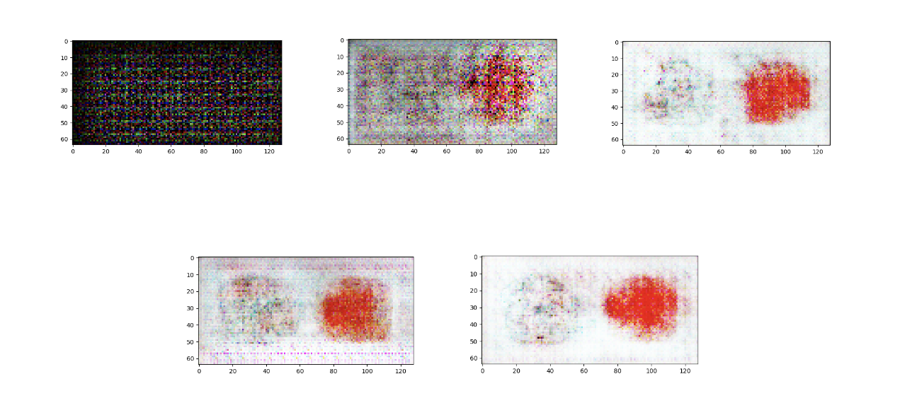
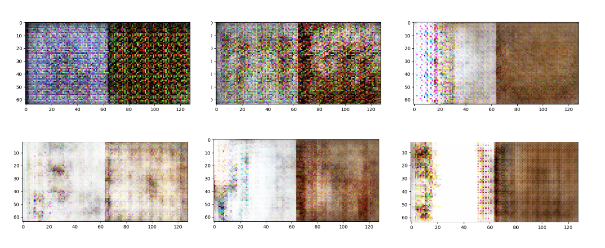

# Sketch to Image Generation

## Introduction

To explore the utilization of deep learning in artistic expression, I build a model that converts hand-drawn sketches to photo-like images, allowing people without artistic backgrounds to see the visual graphics of their work. 

I reimplemented the paper “Sketch-to-Image Generation Using Deep Contextual Completion” (Lu, Yongyi & Wu, Shangzhe & Tai, Yu-Wing & Tang, Chi-Keung. 2017.). I trained the model with sketches we drew, as well as filtered images from the COCO dataset. Given a sketch input, the model would be able to generate colorful images. 

## Methodology

### Data and Preprocessing

I expect our input data to be size 64 * 128, each as a concatenation of a sketch and the corresponding photo/image. A 64 * 64 mask is applied to the right-hand side so that only the sketch on the left-hand side would be fed as an input to the generator, whereas the complete photo without the mask is used to train the discriminator as the "real" labels. The prediction by the generator is used to prepare the discriminator as the "fake" labels.

I begin by creating a simple dataset with very distinguishable sketches using images we found online, and create the corresponding labels using graphic tools such as Photoshop. These simple sketches are categorized into 5 classes and each class has a color: fundamental shapes (circles, squares, …) are red, animals are dark brown, trees are green, flowers are orange, and ships are blue. As I tuned the model to produce images similar to the expected outputs, I switched to a more complex dataset converted from the COCO data. 

Figure 1. Simple sketches created by ourselves

I believe that the COCO dataset, containing 80K images with 80 categories, would provide our model with comprehensive training data with sufficient size and generality. Some sample classes are: cat, dog, umbrella, car, backpack, hotdog, etc. My vision was that given sufficient amounts of data, our model would eventually learn to convert the sketches into real-life pictures given both the outline contour of the object as well as the context of the object. 

My preprocessing of data is divided into 3 steps. First, I downloaded the dataset using FiftyOne and extracted desired classes of objects with a size limitation of no less than 64 * 64 for the sake of more accurate training. Then I used OpenCV to apply filters to convert each colored image into a grayscale sketch-like image after re-scaling the original image to size 64 * 64. Lastly, I concatenated the original images with the sketches, with the sketches on the left-hand side and the original image on the right, generating ready-to-train inputs of shape 64 * 128 * 3.

Figure 2. Sample sketches processed from the COCO dataset

### Model Architecture

I used the model structure given by the paper (Lu, Yongyi & Wu, Shangzhe & Tai, Yu-Wing & Tang, Chi-Keung. 2017.), as illustrated by the figure below. 

Figure 3. Model architecture

Although there exists a relevant project on Github done by the authors of my reference paper, the model in this project is a more advanced version and the functionality is quite different. Also, since the project and paper were created years ago, many codes and functions are outdated and cannot be used or lack readability. Therefore, I decided to only consider the architectural design as a reference but build the model from scratch by myself.

The generator would take in the sketch (64 * 128, but the right-hand side is empty as the real photo is masked out) as the input, flatten it and pass a linear layer, then take the output and pass it through five Conv2DTranspose layers, each with kernel size 5, strides 2, and “same” padding. I used LeakyRelu as the activation function for all the layers, and tanh for the output layer. Batch Normalization is applied after each Conv2DTranspose layer except the last one to increase model efficiency. This upsampling process of the latent space would add non-linearities to the model and produce a higher resolution image of 64 * 128.

The discriminator contains four Cov2d layers, also with kernel size 5 and strides 2, that reduce the feature map’s dimension. The output is then passed to a fully connected Dense layer with softmax activation to produce the one-dimensional probability that tells if the image is fake or not. 

### Loss

I use the weighted sum of the contextual loss and perceptual loss to train the model. The ratio of these two weights is considered a tunable hyperparameter. We chose to calculate the total loss as 0.01 * perceptual loss and 0.99 * contextual loss. The low coefficient of the perceptual loss guarantees a similar appearance of the input and output. The following equation calculates​​ the perceptual loss measures the semantic content of the generated image (achieved by the pre-defined “binary cross-entropy” loss in Keras):

The contextual loss is defined as the following to measure the context similarity between the input sketch and the reconstructed sketch: 

where M is the binary mask of the corrupted joint image and ⊙ denotes the Hadamard production. 
Training and Evaluation

I train alternately between generator and discriminator based on the Tensorflow Keras framework. More specifically, I train the discriminator for 5 epochs, and stop it from training while training the generator for 5 epochs. The training epoch numbers of the generator and the discriminator are also tunable hyperparameters to control and balance the competition between them. I collect sample output images at the end of every epoch, and visualize them for observation. 

I primarily assess the results based on visual outputs from the generator. While it is difficult to evaluate the model quantitatively purely by naked-eye observation, I involved an evaluation model that can compare two images’ identifying features. This evaluation process was inspired by the reference paper, but I didn’t use the same evaluation model. I found that the VGG16 model without the last “fc2” layer can summarize the identifying vectors of the input images, and I can decide the similarity of the two images by calculating the cosine of the angle between their identifying vectors. Through this process, similar evaluation functionality can be achieved in a simple and convenient way. I developed the test function based on the evaluation model, which takes batches of real images and predictions from the generator and returns the average similarity between them.

## Results
Unfortunately, the model hasn’t reached the expected performance, but remarkable progress has been made. I am still working on the simple version data set, and here’re some sample learning processes of the generator:
 

Figure 4. Results after 0, 25, 50, 75, 100 epochs on dataset created by ourselves

The generator hasn’t been able to capture specific and accurate sketch shapes but has already imitated the colors and a general pixel allocation – the learning process is at least obvious.

However, when running the model on the COCO dataset, either the generator or the discriminator would stop learning after around 20 epochs due to the vanishing gradient problem, hence the generator always produces a noise image as the output. Even if we eliminate the training category to only “persons” (around 17000 images) or “buses” (around 300 images). 

Figure 5. Result after training 9, 15, 39, 70, 91, 105 epochs on the “donuts” dataset

I concluded that the following reasons caused the model to fail to generate more complex images from sketches: 

- A lot of the input sketches do not have distinctive borders, and the original images have backgrounds. Hence, the discriminator cannot recognize the clear edges, and the generator cannot learn to fit specific shapes. 
- The model itself is very susceptible to local minimums. Either the generator or the discriminator. GANs’ general stability problem.
- The model architecture does not have enough parameters to learn the complex shapes, colors, and diverse range of categories. 
- Furthur hyperparameter tuning is needed to enhance the generator’s accuracy.

These issues haven’t yet been addressed due to the time and ability limitations of the team, and are the future work and study aims.
